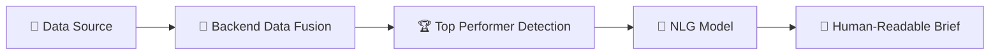
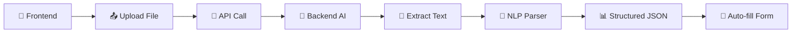

# 🚨 Smart Analytics Dashboard for Police "Good Work Done" (PS-3)

<div align="center">


**🎯 AI-powered dashboard to analyze, visualize, and rank district-level police "Good Work" data from CCTNS**

*AI + Data + Governance = Smarter Policing in Odisha*

</div>


# 🔗 Live Dashboard Access  
**URL:** https://district-intelligence-2.onrender.com/

---

## 🔐 Login Credentials

### **DGP Login**
| Username | Password |
|----------|----------|
| `dgp_odisha` | `dgp123` |

### **SP Logins**
| District | Username | Password |
|----------|-----------|-----------|
| Khordha | `sp_khordha` | `sp123` |
| Cuttack | `sp_cuttack` | `sp123` |

---

## 🏫 Team Information  
**Team No:** 27  
**College:** IIT Bhubaneswar  
**Branch:** CSE  

### 👥 Team Members
- Rustam Kumar  
- Chaitanya Bhardwaj  
- Parth Dodiya  
- Utkarsh Singh  

---

## 📘 Problem Statement  
**Problem Statement (PS):** 3  

---

## 📋 Overview

This project is a **high-performance, role-based web application** designed for senior police officers (DGP, SP) to transform raw CCTNS "Good Work Done" module data into actionable intelligence. It automates data processing, provides AI-driven insights, and creates a data-driven system for performance evaluation and recognition, as specified in the official **PS-3 Problem Statement**.

---

## 🎯 1. The Problem

<table>
<tr>
<td width="50%">

### ❌ Current Challenges

Based on the official CCTNS Problem Statement (PS-3), police districts manually record data for special drives (NBW, narcotics, firearms, etc.), convictions, and detections. This manual process is inefficient, prone to errors, and makes it difficult to:

</td>
<td width="50%">

### 🚧 Key Pain Points

- **📊 Visualize Trends:** Performance data is trapped in static reports, making state-wide visualization impossible
- **🏆 Identify Top Performers:** Difficult to compare and rank districts on key "Good Work" metrics
- **⚙️ Recognize Good Work:** No efficient, transparent system for recognizing exceptional performance
- **📁 Handle Diverse Formats:** Data submitted in a mix of manual forms, Excel sheets, CSVs, and PDFs

</td>
</tr>
</table>

---

## 💡 2. Our Solution: A Two-Stage Strategic Dashboard

<div align="center">

### 🔐 Secure, Role-Based Web Application

*Providing unique dashboards for each level of the police hierarchy*

</div>

### 🌟 I. The "State View" (DGP Dashboard)

> **👨‍✈️ For:** Director General of Police (DGP) — *strategic oversight, trend analysis, and resource allocation*

#### 🎯 Key Features:

| Feature | Icon | Description |
|---------|------|-------------|
| **AI-Generated Monthly Summary** | 🤖 | NLG-based summary identifying top districts for convictions, NBW execution, and narcotics seizures |
| **AI-Powered Performance Forecast** | 📈 | ML model predicts potential underperforming districts next month |
| **Live Geo-Analytics Map** | 🗺️ | Choropleth heatmap of Odisha visualizing metrics like conviction rate and narcotics seizures |
| **Gamified Leaderboards** | 🏅 | Dynamic bar charts ranking districts on "Special Drive" metrics |
| **Automated Report Generation** | 📄 | One-click export to PDF/CSV for official use |

---

### 🌟 II. The "District View" (SP Dashboard)

> **👮 For:** Superintendent of Police (SP) — *operational management and data reporting*

#### 🎯 Key Features:

| Feature | Icon | Description |
|---------|------|-------------|
| **AI-Powered Smart Upload** | 📤 | Uploads PDF/Excel reports; backend AI extracts and pre-fills digital forms |
| **CCTNS "Good Work Done" Forms** | 📝 | Complete digital interface for manual entry |
| **Report Submission & Export** | ✅ | Submit to DGP or export to PDF/Excel/CSV |
| **District KPI Widgets** | 📊 | Real-time charts for pendency, NBW funnel, and missing persons |

---

## 🤖 3. The AI/ML Innovation

<table>
<thead>
<tr>
<th>🧠 AI/ML Model</th>
<th>✨ Feature</th>
<th>🎯 Role & Purpose</th>
</tr>
</thead>
<tbody>
<tr>
<td><strong>Natural Language Generation (NLG)</strong></td>
<td>AI Monthly Summary</td>
<td>🔍 <strong>AI as Analyst</strong> — synthesizes 7 tables into English summary</td>
</tr>
<tr>
<td><strong>Machine Learning (Forecasting)</strong></td>
<td>AI Performance Forecast</td>
<td>📊 <strong>AI as Strategist</strong> — predicts future underperforming districts</td>
</tr>
<tr>
<td><strong>NLP / Regex Parsing</strong></td>
<td>Smart Report Upload</td>
<td>📄 <strong>AI as Clerk</strong> — parses unstructured PDFs and extracts data</td>
</tr>
</tbody>
</table>

---

## 🛠️ 4. Tech Stack

<table>
<thead>
<tr>
<th>⚙️ Layer</th>
<th>🔧 Technologies</th>
</tr>
</thead>
<tbody>
<tr>
<td><strong>Frontend (UI)</strong></td>
<td><code>React 18</code> • <code>React Leaflet</code> • <code>Recharts</code> • <code>Axios</code> • <code>jsPDF</code> • <code>jsPDF-AutoTable</code></td>
</tr>
<tr>
<td><strong>Backend (Server)</strong></td>
<td><code>Node.js</code> • <code>Express.js</code> • <code>JWT</code> • <code>Multer</code> • <code>fs</code> • <code>path</code></td>
</tr>
<tr>
<td><strong>AI/ML & Data</strong></td>
<td><code>pdf-parse</code> • <code>xlsx</code> • <code>csv-parser</code> • <code>JavaScript-based NLG & ML</code></td>
</tr>
</tbody>
</table>

---

## 🚀 5. Getting Started

### 📋 Prerequisites
```bash
✅ Node.js (v18.x or higher)
✅ npm (v9.x or higher)
```

### 🔧 Backend Setup
```bash
cd backend
npm install
npm start
```

> 🌐 Server starts at `http://localhost:8000`

### 🎨 Frontend Setup
```bash
cd frontend
npm install
npm start
```

> 🌐 App runs at `http://localhost:5173`

---

## 🔑 6. Login Credentials

<table>
<thead>
<tr>
<th>👤 Role</th>
<th>🆔 Username</th>
<th>🔐 Password</th>
</tr>
</thead>
<tbody>
<tr>
<td><strong>🎖️ DGP (State)</strong></td>
<td><code>dgp_odisha</code></td>
<td><code>dgp123</code></td>
</tr>
<tr>
<td><strong>👮 SP (Khordha)</strong></td>
<td><code>sp_khordha</code></td>
<td><code>sp123</code></td>
</tr>
<tr>
<td><strong>👮 SP (Cuttack)</strong></td>
<td><code>sp_cctack</code></td>
<td><code>sp123</code></td>
</tr>
<tr>
<td><strong>👮 SP (Ganjam)</strong></td>
<td><code>sp_ganjam</code></td>
<td><code>sp123</code></td>
</tr>
</tbody>
</table>

---

## 🔌 7. API Endpoints

### 🔐 Authentication

| Method | Endpoint | Description |
|--------|-----------|-------------|
| **POST** | `/api/auth/login` | 🔑 Authenticate and get JWT |

### 🎖️ DGP APIs

| Method | Endpoint | Description |
|--------|-----------|-------------|
| **GET** | `/api/ai/monthly_summary` | 🤖 AI NLG summary |
| **GET** | `/api/ai/performance_forecast` | 📈 ML-based performance forecast |
| **GET** | `/api/drives/leaderboard/:metric` | 🏅 District ranking by metric |
| **GET** | `/api/analytics/conviction_rates` | 📊 Ranked conviction rates |
| **GET** | `/api/analytics/map_data` | 🗺️ Geo-analytics data |

### 👮 SP APIs

| Method | Endpoint | Description |
|--------|-----------|-------------|
| **GET** | `/api/district_data/:district/:month` | 📥 Get district data |
| **POST** | `/api/cctns/report` | 📤 Submit Good Work report |
| **POST** | `/api/cctns/upload/nbw` | 🤖 Upload and parse report (AI) |

---

## 📊 8. Data Schema

<table>
<thead>
<tr>
<th>📁 Filename</th>
<th>📋 PS-3 Part</th>
<th>🔑 Key Metrics</th>
</tr>
</thead>
<tbody>
<tr>
<td><code>cctns_nbw.json</code></td>
<td><strong>1a</strong></td>
<td>pending_start_of_month, executed_total, etc.</td>
</tr>
<tr>
<td><code>cctns_firearms.json</code></td>
<td><strong>1b</strong></td>
<td>cases_registered, persons_arrested, etc.</td>
</tr>
<tr>
<td><code>cctns_sand_mining.json</code></td>
<td><strong>1c</strong></td>
<td>cases_registered, vehicle_seized, etc.</td>
</tr>
<tr>
<td><code>cctns_missing_persons.json</code></td>
<td><strong>1d</strong></td>
<td>boy_missing_start, boy_traced, etc.</td>
</tr>
<tr>
<td><code>cctns_pendency.json</code></td>
<td><strong>1f</strong></td>
<td>pendency_over_30_days, pendency_percentage, etc.</td>
</tr>
<tr>
<td><code>cctns_preventive_drives.json</code></td>
<td><strong>1g</strong></td>
<td>preventive_nbw_executed, narcotics_seizure_ganja_kg, etc.</td>
</tr>
<tr>
<td><code>cctns_convictions.json</code></td>
<td><strong>2</strong></td>
<td>ipc_bns_trial_completed, ipc_bns_conviction, etc.</td>
</tr>
</tbody>
</table>

---

## ✨ Feature Highlights

---

### 📄 Feature: Automated Report Generation

> **💡 The dashboard lets officers quickly export "Good Work Done" reports**

- ✅ Choose which widgets to include
- ✅ Download as structured PDF
- ✅ Export as raw CSV/Excel
- ✅ Direct download from DGP Dashboard


---

### 📊 Feature: High-Level KPI Statistics

> **📈 DGP Dashboard shows instant, state-wide KPI summaries**

Live metric cards display:
- ✅ Conviction rate
- ✅ Active AI alerts
- ✅ NBWs executed
- ✅ Firearms seized for the current month


---

### 🎯 Feature Spotlight: AI Performance Forecast ("Districts to Watch")

> **🤖 ML-powered prediction of future district performance**

#### 1️⃣ What is this Feature?

This widget is the **direct implementation** of the PS-3 requirement to *"Predict potential underperforming districts or areas needing attention."*

It is a **machine learning model** that runs on our time-series data (from `cctns_pendency.json`). Instead of just reporting last month's case pendency, this tool **forecasts** what the pendency percentage for every district will be next month.

#### 2️⃣ How it Works (The AI/ML Logic)

| Step | Process | Details |
|------|---------|---------|
| **📥 Data Source** | Backend API | GET `/api/ai/performance_forecast` endpoint |
| **📊 Data Input** | Server loads data | `cctns_pendency.json` with data for all 30 districts for Month 8 & 9 |
| **🤖 ML Model** | Linear Regression | `getPerformanceForecast` function runs linear regression for each district |
| **📈 Prediction** | Trend Analysis | Uses two data points (Aug % and Sep %) to calculate trend line slope |

#### 3️⃣ Why This Feature is Important

- ✅ **Proactive Leadership:** DGPs act before issues escalate
- ✅ **Best Practice Identification:** Spot improvements and apply statewide
- ✅ **Decision Support:** Turns dashboard into strategic planning tool


---

### 🗺️ Feature Spotlight: Geo-Analytics (GIS) Dashboard

> **🌍 Transform complex data into intuitive geographic heatmap**

#### 1️⃣ What is this Feature?

- ✅ Fulfills PS-3 requirements for GIS integration and trend visualization
- ✅ Displays interactive Odisha Choropleth Map
- ✅ Color-coded by performance metrics like Conviction Rate
- ✅ Converts statewide data into visual insights

#### 2️⃣ How it Works (AI/ML & Data Logic)

| Component | Function |
|-----------|----------|
| **📡 Data Source** | Frontend calls `/api/analytics/map_data` |
| **🔗 Backend Data Fusion** | Combines 4 CCTNS sources into unified dataset |
| **🎮 Interactivity** | DGP switches metrics (Conviction, NBW, Ganja) |
| **🎨 Dynamic Styling** | `geoStyle()` assigns colors based on values |
| **ℹ️ On-Hover Info** | Popup shows district-level statistics |

#### 3️⃣ Why This Feature is Important

- 🎯 **Identifies Hotspots:** Quickly highlights problem areas
- 🏆 **Highlights Top Performers:** Shows high-performing districts
- 📊 **Holistic View:** Reveals nuanced insights in popups
- ⚡ **Faster Decisions:** Single powerful visual replaces large datasets


---

### 📝 Feature Spotlight: AI Monthly Summary (NLG)

> **🤖 Plain-English summary of state performance**

#### 1️⃣ What is this Feature?

- ✅ Meets PS-3 requirement for natural-language monthly summaries
- ✅ NLG widget acts like an AI analyst
- ✅ Generates clear, plain-English performance brief for DGP
- ✅ Answers: *"What happened this month, and who performed best?"*

#### 2️⃣ How it Works (AI/ML Logic)


| Step | Process |
|------|---------|
| **📡 Data Source** | Frontend calls `/api/ai/monthly_summary` |
| **🔗 Backend Data Fusion** | API aggregates latest data from all 7 CCTNS files |
| **🏆 Top Performer Detection** | Highest conviction rate, most NBWs, highest narcotics seizure |
| **🤖 NLG Model** | `generateAISummary()` creates clear summary |
| **📄 Output** | Polished, human-readable English brief |

#### 3️⃣ Why This Feature is Important

- ⏱️ **Saves DGP Time:** No need to read multiple reports
- 🏅 **Instant Recognition:** Automatically highlights top performers
- 🎯 **Sets Priorities:** Tells DGP whom to appreciate
- 🌟 **High "Wow" Factor:** Dashboard understands and explains data


---

### 🏅 Feature Spotlight: "Special Drive" Leaderboard

> **🎯 Dynamic "Top 10" rankings for special drive metrics**

#### 1️⃣ What is this Feature?

- ✅ Dynamic leaderboard showing top-performing districts
- ✅ Supports PS-3 needs for recognition, ranking, and competition
- ✅ DGP switches between metrics (Firearms, Sand Mining, NBW)
- ✅ Instant district-wise performance visualization

#### 2️⃣ How it Works (Data & API Logic)

| Component | Process |
|-----------|---------|
| **📊 Data Source** | Multiple CCTNS files (firearms, preventive drives, NBW) |
| **🎮 Frontend Interaction** | DGP selects metric button → updates React state |
| **🔌 Dynamic API** | Calls GET `/api/drives/leaderboard/:metric` |
| **⚙️ Backend Logic** | Aggregates values → sorts → returns Top 10 |
| **📊 Visualization** | BarChart updates automatically |

**Example API Calls:**
- 🔫 Firearms → `/leaderboard/firearms_seized`
- 📋 NBW → `/leaderboard/nbw_executed`

#### 3️⃣ Why This Feature is Important

- 🏆 **Drives Competition:** SPs see their rank and motivation increases
- ⚡ **Quick State Overview:** DGP gets instant category-wise performance
- 💡 **Actionable Insights:** Shows consistently top performers
- 🎯 **Recognition Tool:** Helps leadership reward good work


---

### 📈 Feature Spotlight: Trend Analysis (Month-wise / Drive-wise)

> **📊 Dynamic multi-district trend comparison over time**

#### 1️⃣ What is this Feature?

- ✅ Dynamic multi-series line chart
- ✅ Compares top district performance over time
- ✅ Query example: *"Top 5 districts for NBW Executed over last 6 months?"*
- ✅ Instantly fetches and visualizes trends

#### 2️⃣ How it Works (AI/ML & Data Logic)

| Step | Process |
|------|---------|
| **🎮 Frontend Interaction** | DGP selects metric, time range, top N districts |
| **🔌 Dynamic API** | Triggers GET `/api/trends/:metric?months=6&top=5` |
| **⚙️ Backend Logic** | Builds month keys → generates time-series → computes totals → returns JSON |
| **📊 Frontend Rendering** | Recharts LineChart plots colored line per district |

**Backend Process:**
1. 📅 Builds last X month keys using `buildMonthsList`
2. 📊 Chooses correct dataset for metric
3. 📈 Generates 6-month time-series for all 30 districts
4. 🔢 Computes totals, sorts, extracts Top N
5. 📤 Returns structured JSON: `{ months: [...], series: [...] }`

#### 3️⃣ Why This Feature is Important

- ✅ **True Trend Analysis:** Satisfies PS-3 requirement for month-wise, drive-wise visualization
- 🔍 **Deeper Insight:** Reveals if performance is consistent, improving, or declining
- 📈 **Highlights Momentum:** Shows positive/negative shifts for early intervention
- 🎯 **Highly Versatile:** Works for all major metrics (Narcotics, NBW, Firearms, Sand Mining)


---

### 🏆 Feature Spotlight: Top Performing Districts (Trend Summary)

> **📊 Ranked summary of overall top-performing districts**

#### 1️⃣ What is this Feature?

- ✅ Ranked summary widget for any metric over selected time period
- ✅ Complements Trend Analysis with cumulative performance
- ✅ Answers: *"Who performed the best overall in the last X months?"*
- ✅ Example: For 6-month Ganja seizures, Malkangiri ranks #1 with 10,200 kg

#### 2️⃣ How it Works (Data & API Logic)

| Component | Details |
|-----------|---------|
| **🔌 Same API** | Uses `/api/trends/:metric` |
| **🎮 Frontend Interaction** | DGP selects metric (e.g., narcotics_ganja_kg) and months (e.g., 6) |
| **📡 Dynamic API Call** | `/api/trends/narcotics_ganja_kg?months=6&top=5` |
| **⚙️ Backend Logic** | Builds 6-month time-series → computes totals → sorts → returns Top 5 |
| **📊 Frontend Rendering** | Displays district names with total values in clean, ordered list |

#### 3️⃣ Why This Feature is Important

- 🎯 **Clear Rankings:** Unambiguous "Top 5" list for quick decisions
- 🏅 **Recognition-Oriented:** Directly supports "Good Work Recognition"
- 🏆 **Drives Competition:** Encourages districts to improve with clear targets
- 🔄 **Highly Flexible:** Works for any metric and time range


---

### 🎯 Feature Spotlight: District Performance Spotlight

> **🔍 Top 3 and Bottom 3 districts for key metrics**

#### 1️⃣ What is this Feature?

- ✅ High-level summary widget
- ✅ Highlights Top 3 and Bottom 3 districts for key metrics
- ✅ Directly supports PS-3 needs for recognition and identifying districts needing attention

**Provides instant actionable insights:**
- 🟢 **Top 3 (Conviction Rate)** → Who to appreciate
- 🔴 **Bottom 3 (Conviction Rate)** → Who needs support
- 🟡 **Top 3 (Workload)** → Who is overburdened

#### 2️⃣ How it Works (Data & API Logic)

| Data Source | Purpose |
|-------------|---------|
| 📡 `/api/analytics/conviction_rates` | Top/Bottom 3 districts |
| 📡 `/api/analytics/workload` | Highest Workload districts |

**Frontend Logic:**
- ✅ `DistrictSpotlightWidget` receives data as props
- ✅ Sorts conviction rates descending → Top 3
- ✅ Sorts conviction rates ascending → Bottom 3
- ✅ Sorts workload descending → Highest Workload

**Visualization:** Three clean lists using:
- 🟢 Green for top performers
- 🟠🔴 Orange/red for areas needing focus

#### 3️⃣ Why This Feature is Important

- ⚡ **Ultimate Snapshot:** DGP gets everything in 10 seconds
- 🏆 **Drives Accountability:** Publicly highlights high/low performers
- 🎯 **Guides Leadership Action:** Helps decide who to praise and where to direct resources


---

### 📋 Feature Spotlight: Auto-Report for Exceptional Performance

> **🤖 AI-generated "Good Work Done" report ranking all districts**

#### 1️⃣ What is this Feature?

- ✅ Final AI-generated report ranking all 30 districts
- ✅ Unified **Good Work Score** combining multiple metrics
- ✅ Transparent scoring system (Conviction Rate + Firearms Seized)
- ✅ Clear, data-driven basis for district recognition

#### 2️⃣ How it Works (AI/ML Logic)

| Step | Process |
|------|---------|
| **📡 Data Source** | Dedicated endpoint `/api/reports/good-work-done` |
| **🔗 Data Fusion** | Aggregates latest metrics from multiple CCTNS sources |
| **🤖 AI Scoring Model** | Normalizes each metric (0–1 scale) |
| **⚖️ Weighted Calculation** | Applies weights (e.g., 60% Conviction, 40% Firearms) |
| **📊 Ranking** | All districts sorted by final Good Work Score |
| **📊 Visualization** | Clean ranked table highlighting top performers |

**Data Sources:**
- ✅ Conviction rate → `cctns_convictions.json`
- ✅ Total firearms seized → `cctns_firearms.json`
- ✅ Expandable to NBW, Narcotics, etc.

#### 3️⃣ Why This Feature is Important

- 🏆 **Ultimate Recognition Tool:** Instantly identifies districts deserving praise
- ⚖️ **Transparent & Fair:** Shows each metric alongside score
- 📄 **Drives Auto-Reports:** Powers PDF/CSV export feature
- 🏅 **Encourages Competition:** Ultimate leaderboard motivating districts


---

### 📊 Feature Spotlight: District Operational KPIs (SP Dashboard)

> **🎯 Tactical dashboard converting complex statistics into quick visual insights**

#### Widget Overview

<table>
<thead>
<tr>
<th>🎛️ Widget</th>
<th>📋 Feature Description</th>
<th>⚡ Operational Importance</th>
</tr>
</thead>
<tbody>
<tr>
<td><strong>📊 Case Pendency Gauge</strong></td>
<td>Shows % of cognizable cases pending over 30 days (from <code>cctns_pendency.json</code>)</td>
<td><strong>Core Efficiency Indicator:</strong> High pendency (red zone) signals immediate need for case review and faster investigation</td>
</tr>
<tr>
<td><strong>🔽 NBW Drive Funnel</strong></td>
<td>Visualizes flow: Total Issued → Disposed → Executed (from <code>cctns_nbw.json</code>)</td>
<td><strong>Resource & Process Insight:</strong> Helps SP identify bottlenecks—whether warrants are piling up or execution is slow</td>
</tr>
<tr>
<td><strong>👥 Missing Persons Drive</strong></td>
<td>Bar chart comparing Missing vs. Traced counts (with age/gender breakdown)</td>
<td><strong>Success & Accountability Metric:</strong> Shows effectiveness of tracing efforts and highlights priority cases</td>
</tr>
</tbody>
</table>


---

### 📝 Feature Spotlight: CCTNS Report Submission Module (SP Dashboard)

> **📤 SP's primary interface for entering, managing, and submitting monthly "Good Work Done" data**

#### 1️⃣ Digital Forms (Data Entry)

- ✅ Structured digital version of CCTNS Annexure tables
- ✅ Clear, standardized sections (NBW Drive, Firearms Drive, etc.)
- ✅ **Importance:** Replaces error-prone spreadsheets and paper forms
- ✅ Ensures clean, consistent data at source
- ✅ Fulfills "Manual Forms → Digital Forms" requirement

#### 2️⃣ Submit / Export Menu (Action Center)

<table>
<thead>
<tr>
<th>⚡ Action</th>
<th>🎯 Purpose</th>
<th>📊 Operational Importance</th>
</tr>
</thead>
<tbody>
<tr>
<td><strong>📤 Submit to DGP</strong></td>
<td>Sends finalized district report to central server</td>
<td><strong>Compliance & Accountability:</strong> Main data submission step; ensures official filing of monthly performance</td>
</tr>
<tr>
<td><strong>📄 Download PDF / Excel / CSV</strong></td>
<td>Generates formatted copy of submitted report</td>
<td><strong>Local Auditing:</strong> Allows SP to keep verified district records and supports official export requirements</td>
</tr>
</tbody>
</table>

#### 💡 Why This Module Matters

This submission system is the **backbone of the entire project**—ensuring accurate, clean, and complete data collection before feeding it into the DGP's AI-driven analytics dashboard.


---

### 🤖 Feature Spotlight: Smart Report Upload (AI)

> **📤 Automates data extraction from PDF/Excel files and auto-fills CCTNS report form**

#### 1️⃣ What is this Feature?

- ✅ Upload existing digital reports (PDF/XLSX) instead of manual entry
- ✅ **Importance:** Fully meets PS-3 requirement to handle diverse file formats
- ✅ Automates data entry process
- ✅ Eliminates manual errors
- ✅ Saves significant administrative time

#### 2️⃣ How it Works (AI/NLP Logic)


| Step | Process | Details |
|------|---------|---------|
| **👤 Frontend** | User uploads file | Selects report type (e.g., NBW Drive) |
| **🔌 API Call** | POST to backend | File sent to POST `/api/cctns/upload/nbw` |
| **🤖 Backend AI** | PDF Processing | If PDF → extract text using `pdf-parse` |
| **🧠 NLP Analysis** | Text parsing | `parseNbwPdfText` (AI/NLP regex parser) |
| **🔍 Keyword Extraction** | Data extraction | Identifies keywords (e.g., "Executed total", "Pending as on") |
| **📊 Frontend Output** | Structured JSON | Returns `{ executed_total: 250 }` to auto-fill form |

#### 3️⃣ Why This Feature is Crucial

- ✅ **High Accuracy:** Removes manual entry errors at source
- ⚡ **High Efficiency:** Saves hours of work per district every month
- 🤖 **Real, Practical AI:** Demonstrates effective use of AI/NLP
- 🎯 **Automates Routine Tasks:** Transforms police administrative workflow


---

<div align="center">

## 🎯 Project Vision

**Analytics Dashboard for Police (CCTNS Good Work Done)**  
*AI + Data + Governance = Smarter Policing in Odisha*

---

### 🌟 Built with ❤️ for Odisha Police


</div>
